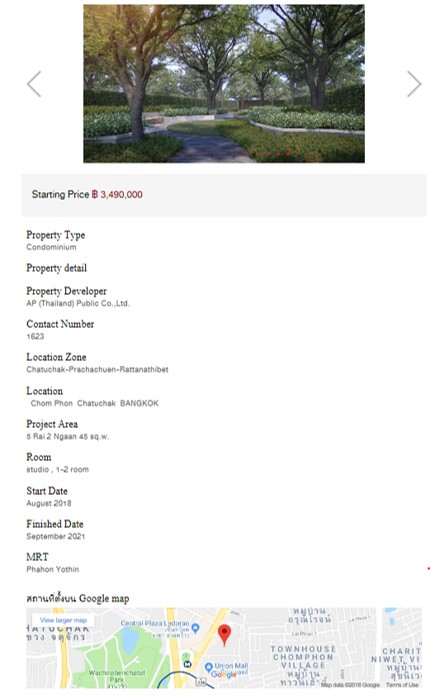
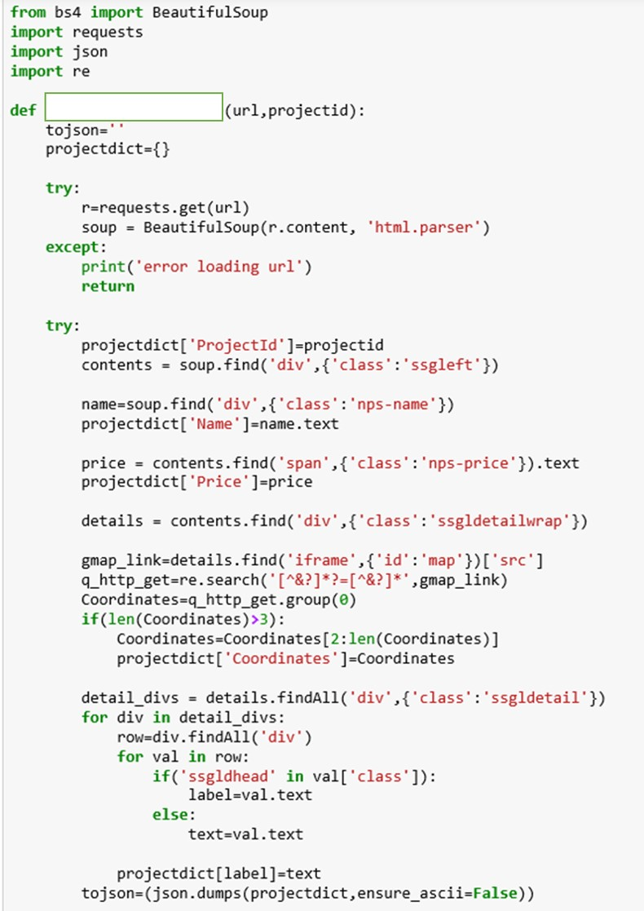
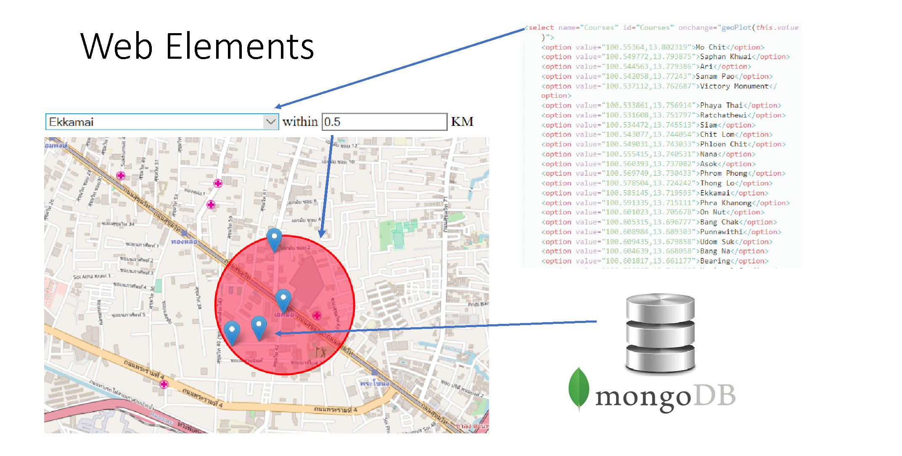
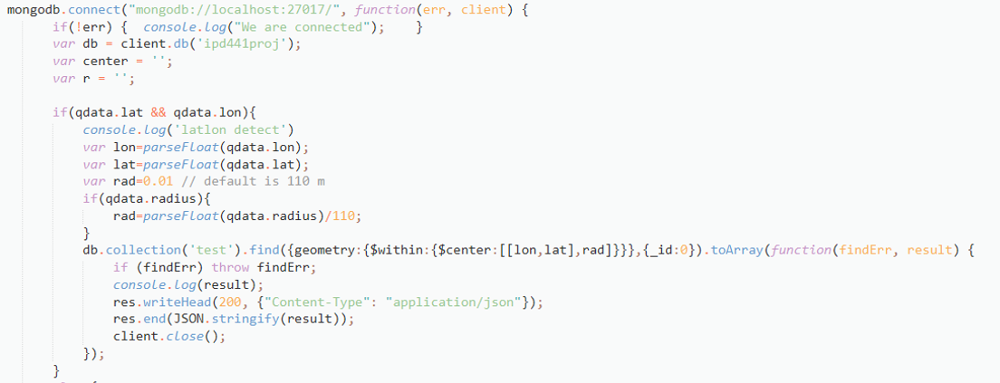
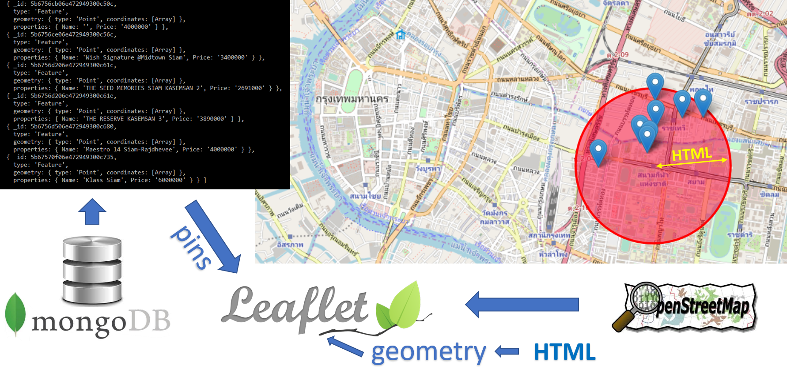
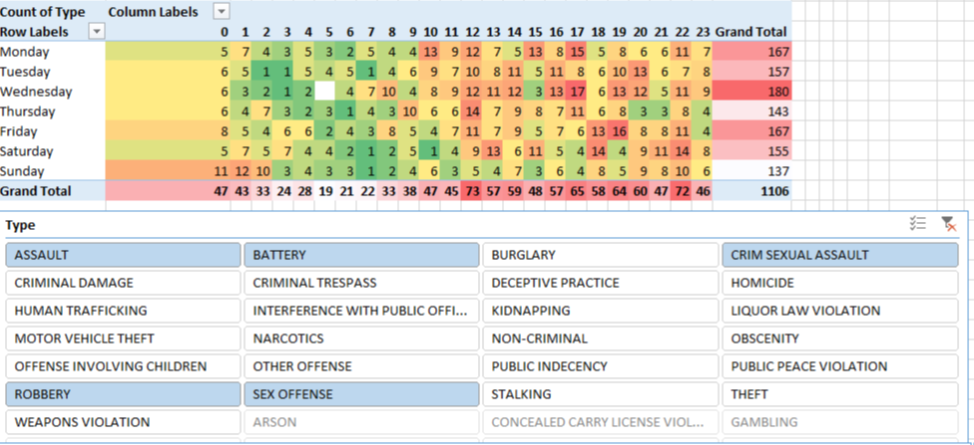

## Projects

More Upcoming Project
* <a href="#listing-search-tool-on-leaflet-nodejs-web-application-to-query-assets-in-proximity-of-train-station-geojson-and-mongodb">Temporal Chicago Crime Interactive Map and Analysis under User-centric hierarchies (R and Shiny module)</a>
* <a href="#temporal-chicago-crime-interactive-map-and-analysis-under-user-centric-hierarchies-r-and-shiny-module">Listing search tool on leaflet NodeJS web application to query assets in proximity of train station (GeoJSON and MongoDB)</a>
* Automated Valuation Modeling using Linear Regression Techniques (SAS)
* Listing search tool on leaflet NodeJS web application to query assets in proximity of train station (GeoJSON and MongoDB)
* Decentralized Arduino Supervision and Control System for Home Automation
* Three Dimension LED Matrix Multiplexing on Arduino Platform
* Private Software as a Service using Optware on DD-WRT Custom Firmware Routers
* Private Cloud Solution for Remote Multimedia Access

## Listing search tool on leaflet NodeJS web application to query assets in proximity of train station (GeoJSON and MongoDB)

The purpose of this project is to demonstrate practical application of one of the databases of big data and its feature. The concept is to develop a tool that allow users to search apartments and condominiums within a specific distance from the train station. As we all know, in a highly dense area or the central business district, the location, and to be more specific, the distance to the public transportation is a major factor in purchasing  or renting a condominium. Also, the traffic is pretty extreme in Bangkok so transportation by bus or personal vehicle was not considered.

In class, I learned MongoDB and Cassandra. I’ve chosen Mongo for it superior ability to store and manipulate JSON format. Also, the geoJSON features allow data to be fetched using geospatial queries which is suitable for the design of the web application.

The web application communicates to the database using the nodeJS API. The scope is to implement a website that includes the front end interface using an interactive map, the backend that facilitates such communication to the database as well as the database that stores the information of condominium projects.

Data acquisition

The data was acquired from web scrapping techniques in python. I used beautiful soup to parse the html element. The original data was from a website of listings which included pages of information regarding condominium projects in bangkok. The results are saved in a JSON file and are processed to comply with geoJSON format and imported to MongoDB.

<p align="center">
  
</p>

Ideally, we want information in the following format

| Property Type  | Property Detial | Property Developer | ... |
| ------------- | ------------- | --- | ------------- | 
| Condominium  | A few steps from the Ekkamai BTS station lies a luxurious comdominium complex...  | AP Thai | ... |
| Single Family Home  | Cutaway from the busy city of Bangkok, you can enjoy the most of family time...  | AP Thai | ... |

<p align="center">
  
</p>

To save this information as JSON format, the data is stored as a dictionary
```
{     
     "Name":"Life Ladprao"
,    "Price":"฿ 2,900,000"
,    "Coordinates":"13.817551,100.562723"
,    "Property Type":"Condominium"
,    "Property detail":""
,    "Property Developer":"AP Public Co.,Ltd."
,    "Location :"Chatuchak"
,    "Project Area":"\n  7 Rai 71 sq.w."
,    "Room":"studio , 1-2 room , Duplex"
,    "Date":"July 2018"
,    "MRT":"Phahon Yothin"
}
```

The data is then converted into GeoJSON format
```{    "_id":"5b6756ac06e472949300c43b"
,   "type":"Feature"
,   "geometry":{       "type":"Point"
,      "coordinates":[          100.562723,         13.817551      ]   }
,   "properties":
{      "Name":"Life Ladprao"
,      "Price":"2900000"   
}}
```

Now on to the web application, these are the elements in the main user interface.
<p align="center">

</p>

MongoDB is push with query by the following mechanism
<p align="center">

</p>

Everything orchestrates into a map user interface that is interactive and displays content is most user friendly way as alike the web elements figure above.
<p align="center">

</p>
<p align="center">

</p>

## Temporal Chicago Crime Interactive Map and Analysis under User-centric hierarchies (R and Shiny module)

This project is inspired by my personal experience when I was deciding on which Chicago neighborhood is ideal for renting an apartment. The things i consider are safety, distance to public transportation, distance to downtown and price.

<p align="center">

</p>

Safety is the most important concern of all. It can be broken down into two aspects which are in regards to the apartment building and the route from the public transportation to the building. I looked at the no go zone map when I started researching for apartments in Chicago. Here is an example:

This map however fails to account for explicitly showing the two safety aspects mentioned. The map includes all types of crime which are not relevant to user needs. Thus an interactive map that allows user to switch through crime types would better provide this information. Alternatively, several static maps of different crime types can also answer to these needs.

I contributed the this project in programming visualization in R and by driving team forward to meet deliverable requirements. After teaming with five people through the discussion forum, I’ve set up meetings and agendas and have taken minutes of meeting on three meetups. When it was close to PD2 deadline, we did not have directions as out EDA shows no interesting patterns or correlation on the our hypothesis questions which involves crossing Chicago crime data with other data (eg. census data). I got inspired by making examples of heatmap with Excel using pivot tables,data slicers, and colored auto-formatting.
<p align="center">

</p>


More Upcoming Project
* Automated Valuation Modeling using Linear Regression Techniques (SAS)
* Listing search tool on leaflet NodeJS web application to query assets in proximity of train station (GeoJSON and MongoDB)
* Decentralized Arduino Supervision and Control System for Home Automation
* Three Dimension LED Matrix Multiplexing on Arduino Platform
* Private Software as a Service using Optware on DD-WRT Custom Firmware Routers
* Private Cloud Solution for Remote Multimedia Access

[editor on GitHub](https://github.com/siravich-khongrod/siravich-khongrod.github.io/edit/master/README.md) 


[Find me on LinkedIn](https://www.linkedin.com/in/siravich-folk-khongrod/)
