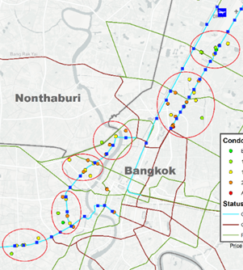
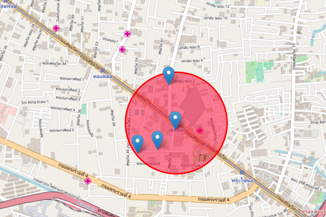
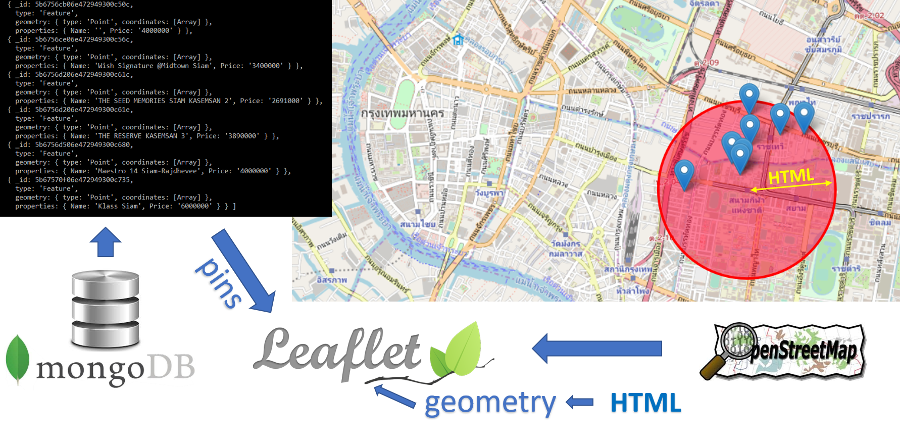
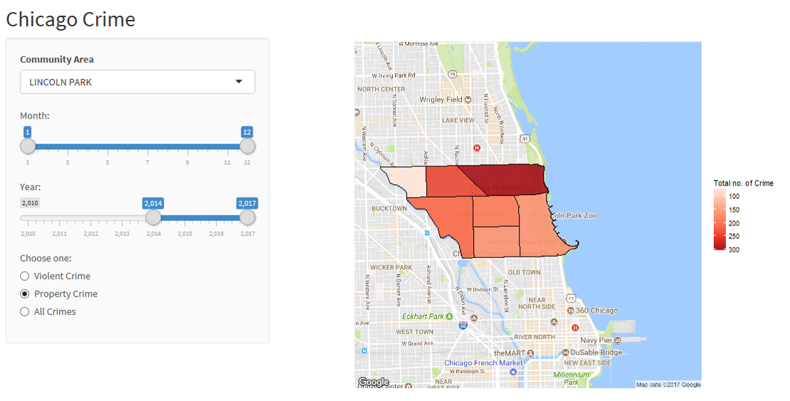

Quoted by Michio Kaku, the higher dimensions might be out of bounds of our universe. I believe we are living in the third dimension for having either time or spatial position as the fourth dimension. These choices have always been ambigious. Still, we attempt with struggle to visualize these data. This was why I have chosen time series and geospatial data analysis as my electives.

Being visionary, I tell myself these are the essential skills that would suffice my career path. Over the past years I have shaped myself to be fully equipted with analytic skills that allow me to further strive to the management role directly involved with the Data Analytics.

Storytelling, was the one that I pin essence. This is where I put my best effort. I demonstrate this skill by ellaborating through the projects I have developed over the past years. The project ideas are mostly practical, meaning they are in real world application, not only academic or theoretical. The art of conveying complex ideas would connect my world of computing to the ecosystem of business network leading to the future of technology.

## Projects Directory
* <a href='#geospatial-analysis-of-market-activity-in-response-to-transit-development-of-bangkok'>Geospatial Analysis of Market Activity in Response to Transit Development of Bangkok</a>
* <a href="#listing-search-tool-on-leaflet-nodejs-web-application-to-query-assets-in-proximity-of-train-station-geojson-and-mongodb">Listing search tool on Leaflet NodeJS Web Application to Query Assets in Proximity of Train Station (GeoJSON and MongoDB)</a>
* <a href="#temporal-chicago-crime-interactive-map-and-analysis-under-user-centric-hierarchies-r-and-shiny-module">Temporal Chicago Crime Interactive Map and Analysis under User-centric hierarchies (R and Shiny module)</a>
* Automated Valuation Modeling using Linear Regression Techniques (SAS)
* Decentralized Arduino Supervision and Control System for Home Automation
* Three Dimension LED Matrix Multiplexing on Arduino Platform
* Private Software as a Service using Optware on DD-WRT Custom Firmware Routers
* Private Cloud Solution for Remote Multimedia Access

## <a style="color:#159957;" href='static/geospatial-analysis.html'>Geospatial Analysis of Market Activity in Response to Transit Development of Bangkok</a>

The objective is to analyse the market activity of real estate developer from data of condominium projects that are built near the train station in Bangkok. The first part aims to study the overall pattern by the operational status of the train system. Some patterns of market activity of real estate development are expected to co-exist corresponding to the development of new trains. The second part aims to investigate the area that has higher market activity and conduct an in-depth analysis of the project development in those areas as well as validating if it corresponds to the same expected pattern of having an inverse relationship between price and distance to the train station. <a href='static/geospatial-analysis.html'>**Continue Reading**</a>

## <a style="color:#159957;" href='static/listing-search-tool-map.html'>Listing search tool on leaflet NodeJS web application to query assets in proximity of train station (GeoJSON and MongoDB)</a>

The purpose of this project is to demonstrate practical application of one of the databases of big data and its feature. The concept is to develop a tool that allow users to search apartments and condominiums within a specific distance from the train station. As we all know, in a highly dense area or the central business district, the location, and to be more specific, the distance to the public transportation is a major factor in purchasing  or renting a condominium. <a href="listing-search-tool-map.html">**Continue Reading**</a>

## <a style="color:#159957;" href="static/temporal-interactive-chicago-crime-map.html">Temporal Chicago Crime Interactive Map and Analysis under User-centric hierarchies (R and Shiny module)</a>

This project is inspired by my personal experience when I was deciding on which Chicago neighborhood is ideal for renting an apartment. The things i consider are safety, distance to public transportation, distance to downtown and price.
<a href="static/temporal-interactive-chicago-crime-map.html">**Continue Reading**</a>

______________________________________

# Reseach Papers
## An evaluation of writeprint matching method to identify the authors of Thai online messages
Marukatat, Rangsipan & Khongrod, Siravich. (2015). An evaluation of writeprint matching method to identify the authors of Thai online messages. 1-5. 10.1109/SNPD.2015.7176200. 

Abstract:
This research studies the author identification of Thai online messages, based on 54 writing attributes. The method in focus is writeprint matching, which employs frequent pattern mining to create the writeprint of each suspect and computes a similarity score between this writeprint and the pattern found in an anonymous message. It achieved an average accuracy of 82%, while other well-known methods, support vector machine (SVM) and C4.5 decision tree, achieved average accuracies of 89% and 81%, respectively. As for the identification of individual author, all three methods were as good as each other in most cases. The writeprint matching method had potential in reducing Type I error or the chance of dismissing real offenders. However, its performance was still limited when the suspects had too similar writing styles.

Published in: 2015 IEEE/ACIS 16th International Conference on Software Engineering, Artificial Intelligence, Networking and Parallel/Distributed Computing (SNPD) Japan
[https://ieeexplore.ieee.org/document/7176200](https://ieeexplore.ieee.org/document/7176200)

## Decentralized Supervision and Control System for Home Automation

Many home automation systems today rely on a single supervision or central control system which links to all the sensors and control units. Apart from having users have to invest a large amount of money for such system, the system has to be initially implemented or re-implemented with subject to changes by specialists. Moreover, there are certain limitations to hardware capabilities such as computational power, number of interface, physical hardware reachability.

This project proposes a different approach for such system having many units of low computational power control system as nodes distributed across a networked system.

#### More Upcoming Projects
* Automated Valuation Modeling using Linear Regression Techniques (SAS)
* Listing search tool on leaflet NodeJS web application to query assets in proximity of train station (GeoJSON and MongoDB)
* Three Dimension LED Matrix Multiplexing on Arduino Platform
* Private Software as a Service using Optware on DD-WRT Custom Firmware Routers
* Private Cloud Solution for Remote Multimedia Access

# Other Projects
* Websites: [http://www.asianlegal.co.th] (http://www.asianlegal.co.th)
* Personal Music Server  

## [Hobbies](static/hobbies.html)

[editor on GitHub](https://github.com/siravich-khongrod/siravich-khongrod.github.io/edit/master/README.md) 

[Find me on LinkedIn](https://www.linkedin.com/in/siravich-folk-khongrod/)

