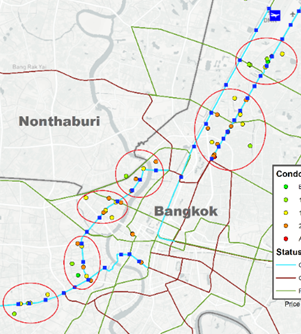
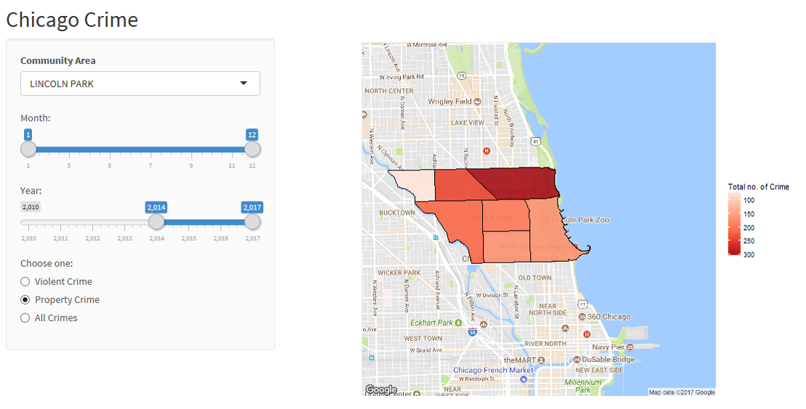

Quoted by Michio Kaku, the higher dimensions might be out of bounds of our universe. I believe we are living in the third dimension for having either time or spatial position as the fourth dimension. These choices have always been ambigious. Still, we attempt to visualize these data. This was why I have chosen time series and geospatial data analysis as my electives.

Visionary, I am, I tell myself these are the essential skills that would suffice my career path. Over the past years I have shaped my self to be fully equipted with analytic skills that allow me to further strive to the management role directly involved with the Data Analytics.

Storytelling, was the one that I pin the essence. This is where I put my best effort. I demonstrate this skill by ellaborating through the projects I have developed over the past years. The project ideas are mostly practical, meaning they are in real world application, not only academic or by theory. The art of conveying complex ideas would connect my world of computing to the ecosystem of business network leading to the future of technology.

## Projects Directory
* <a href='./geospatial-analysis.html'>Geospatial Analysis of Market Activity in Response to Transit Development of Bangkok</a>
* <a href="#listing-search-tool-on-leaflet-nodejs-web-application-to-query-assets-in-proximity-of-train-station-geojson-and-mongodb">Listing search tool on Leaflet NodeJS Web Application to Query Assets in Proximity of Train Station (GeoJSON and MongoDB)</a>
* <a href="#temporal-chicago-crime-interactive-map-and-analysis-under-user-centric-hierarchies-r-and-shiny-module">Temporal Chicago Crime Interactive Map and Analysis under User-centric hierarchies (R and Shiny module)</a>
* Automated Valuation Modeling using Linear Regression Techniques (SAS)
* Decentralized Arduino Supervision and Control System for Home Automation
* Three Dimension LED Matrix Multiplexing on Arduino Platform
* Private Software as a Service using Optware on DD-WRT Custom Firmware Routers
* Private Cloud Solution for Remote Multimedia Access

## <a style="color:#159957;" href='./geospatial-analysis.html'>Geospatial Analysis of Market Activity in Response to Transit Development of Bangkok</a>

The objective is to analyse the market activity of real estate developer from data of condominium projects that are built near the train station in Bangkok. The first part aims to study the overall pattern by the operational status of the train system. Some patterns of market activity of real estate development are expected to co-exist corresponding to the development of new trains. The second part aims to investigate the area that has higher market activity and conduct an in-depth analysis of the project development in those areas as well as validating if it corresponds to the same expected pattern of having an inverse relationship between price and distance to the train station. <a href='./geospatial-analysis.html'>**Continue Reading**</a>

## <a style="color:#159957;" href='./listing-search-tool-map.html'>Listing search tool on leaflet NodeJS web application to query assets in proximity of train station (GeoJSON and MongoDB)</a>

The purpose of this project is to demonstrate practical application of one of the databases of big data and its feature. The concept is to develop a tool that allow users to search apartments and condominiums within a specific distance from the train station. As we all know, in a highly dense area or the central business district, the location, and to be more specific, the distance to the public transportation is a major factor in purchasing  or renting a condominium. Also, the traffic is pretty extreme in Bangkok so transportation by bus or personal vehicle was not considered.

## <a style="color:#159957;" href='./temporal-interactive-chicago-crime-map.html'>Temporal Chicago Crime Interactive Map and Analysis under User-centric hierarchies (R and Shiny module)</a>

This project is inspired by my personal experience when I was deciding on which Chicago neighborhood is ideal for renting an apartment. The things i consider are safety, distance to public transportation, distance to downtown and price.

More Upcoming Project
* Automated Valuation Modeling using Linear Regression Techniques (SAS)
* Listing search tool on leaflet NodeJS web application to query assets in proximity of train station (GeoJSON and MongoDB)
* Decentralized Arduino Supervision and Control System for Home Automation
* Three Dimension LED Matrix Multiplexing on Arduino Platform
* Private Software as a Service using Optware on DD-WRT Custom Firmware Routers
* Private Cloud Solution for Remote Multimedia Access

[editor on GitHub](https://github.com/siravich-khongrod/siravich-khongrod.github.io/edit/master/README.md) 

[Find me on LinkedIn](https://www.linkedin.com/in/siravich-folk-khongrod/)

