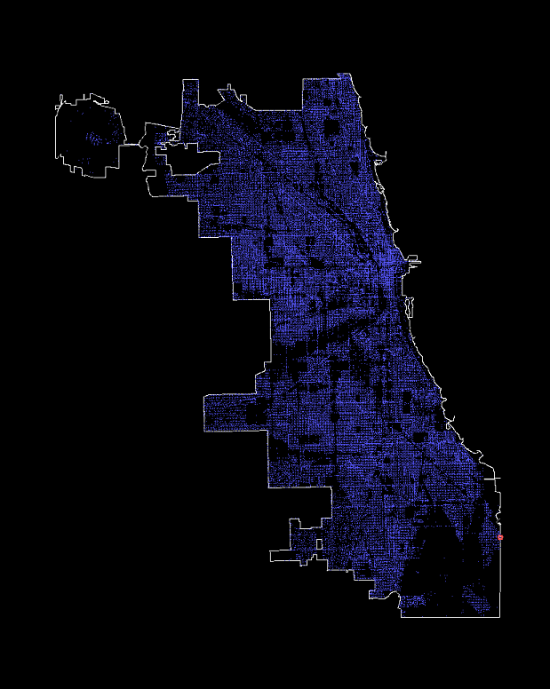

# Spatial Joining with R




Today I demonstrate how to perform a spatial join with R. Spatial joining, at least in this case, is to assign a geographical indicator using coordinates.

The example below is to spatial join Chicago crime data with the census tract. This allow the team to perform analysis using other geographical indicators such as market conditions.
You might notice that I converted spatial points to simple features. Simple features is a standardized way to encode spatial vector data and simple feature makes joining easy.
Alternatively, it is possible to using the base class function 'over', but this method outputs only the right table of join, meaning that this output will need to be appended to the original table which makes the process tedious when it comes to spatial points fallig off the outer boundary of the shapefile.

More information regarding SF package can be found here: 
[Comprehensive R Archive Network](https://cran.r-project.org/web/packages/sf/vignettes/sf1.html)

``` R
getTractShp <- function(filedir){
  tractshp <- readOGR(dsn = filedir)
  tractshp <- spTransform(tractshp, CRS("+proj=longlat +datum=NAD83"))
  tractshp
}

getCrimeSP <- function(crimedf,projection=CRS("+proj=longlat +datum=NAD83")) {
  coords <- crimedf[c("Longitude","Latitude")]
  SpatialPointsDataFrame(coords,crimedf,proj4string=projection)
}

join_tract <- function(sp,tractshp) {
  sf.tract <- st_as_sf(tractshp[4])
  sf.pts <- st_as_sf(sp)
  st_join(sf.pts,sf.tract)
}

library(rgdal)
library(sp)
library(rgeos)
library(sf)

notjoin <- {}
tractshp <- getTractShp("U:/Projects/Chicago Crime/tracts10wcca/tracts10wcca.shp")
for (filename in paste0("crime_",2002:2018,".csv")) {
  print(filename)
  crimecsv <- read.csv(filename)
  sp <- getCrimeSP(crimecsv)
  rm(crimecsv)
  tractjoin <- join_tract(sp,tractshp)
  rm(sp)
  tractjoin <- as.data.frame(tractjoin[-ncol(tractjoin)])
  tractjoin <- tractjoin[-ncol(tractjoin)]
  
  notjoin[filename] <- sum(is.na(tractjoin$TractFIPS_))
  write.csv(tractjoin,file=paste0("tractjoin_",filename))
}

# Display the number of datapoints that falls of the shapefile boundary.
notjoin
```
