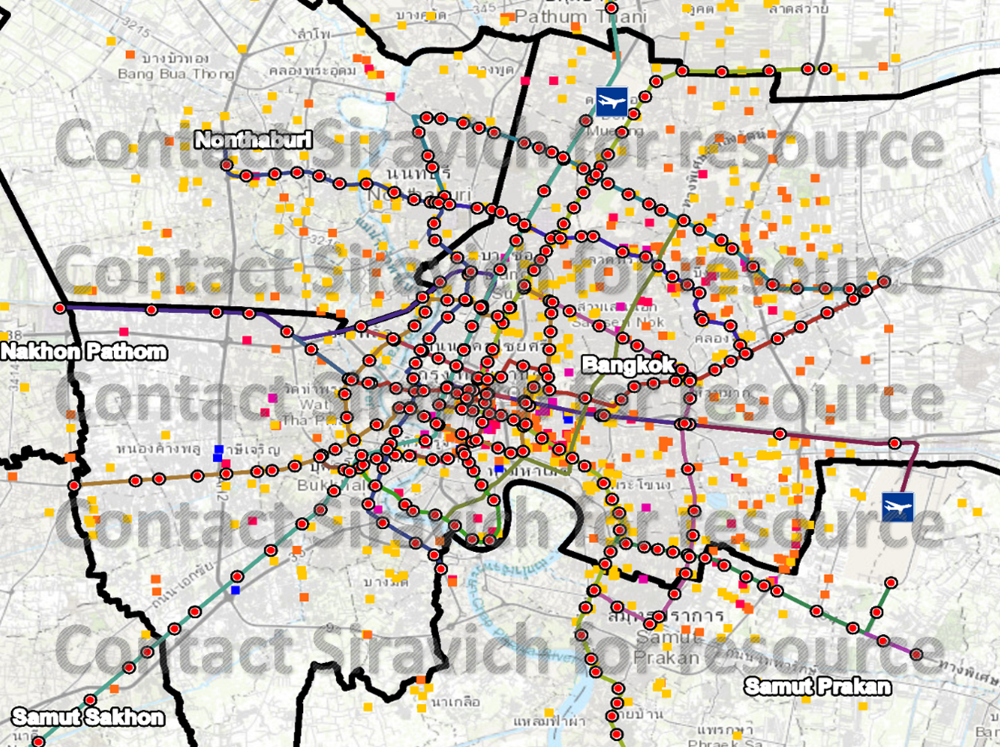

## Geospatial Analysis of Market Activity in Response to Transit Development of Bangkok

The objective is to analyse the market activity of real estate developer from data of condominium projects that are built near the train station in Bangkok. The first part aims to study the overall pattern by the operational status of the train system. Some patterns of market activity of real estate development are expected to co-exist corresponding to the development of new trains. The second part aims to investigate the area that has higher market activity and conduct an in-depth analysis of the project development in those areas as well as validating if it corresponds to the same expected pattern of having an inverse relationship between price and distance to the train station.

