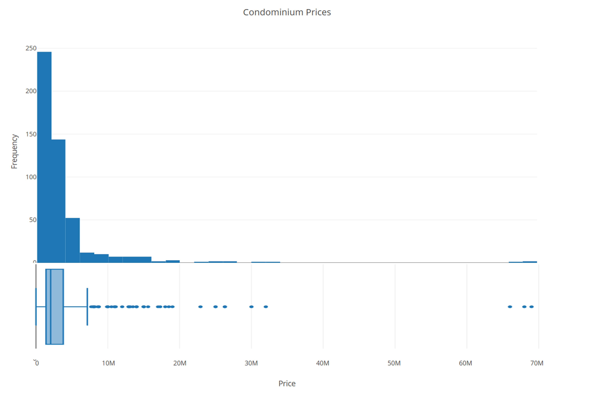
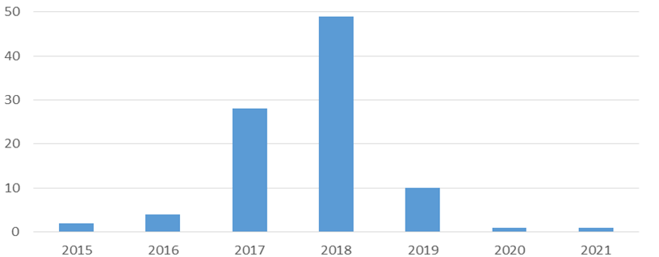
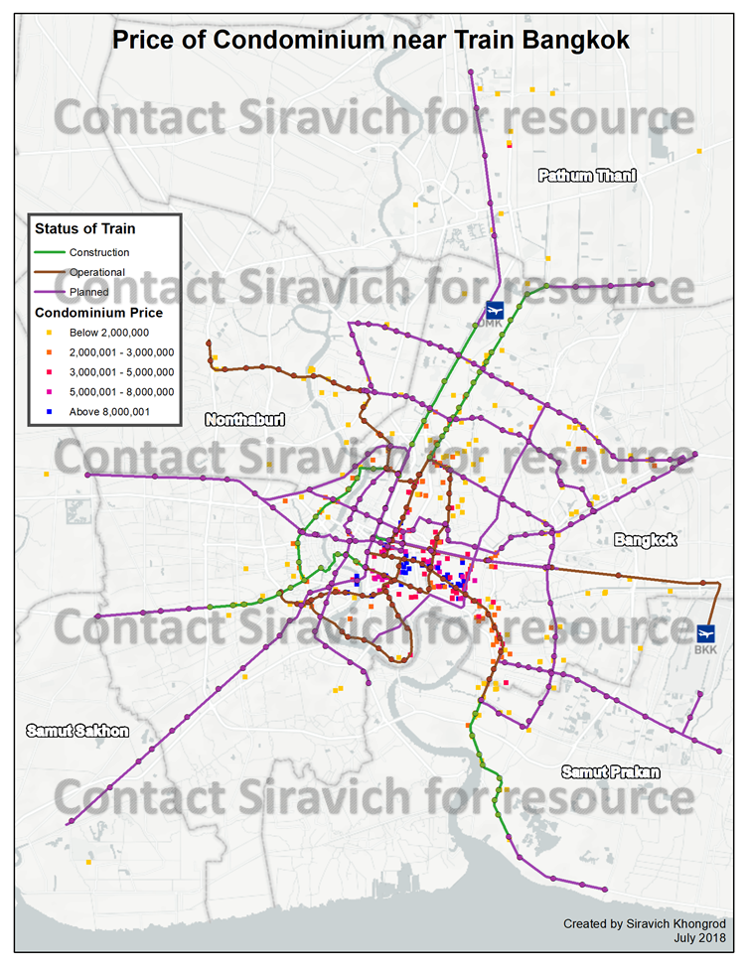
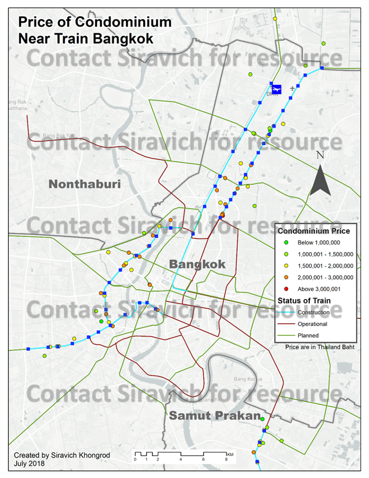
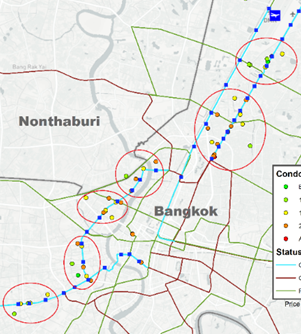

## Geospatial Analysis of Market Activity in Response to Transit Development of Bangkok

The objective is to analyse the market activity of real estate developer from data of condominium projects that are built near the train station in Bangkok. The first part aims to study the overall pattern by the operational status of the train system. Some patterns of market activity of real estate development are expected to co-exist corresponding to the development of new trains. The second part aims to investigate the area that has higher market activity and conduct an in-depth analysis of the project development in those areas as well as validating if it corresponds to the same expected pattern of having an inverse relationship between price and distance to the train station.

Overview
In 2018, these are the stations that are under construction. The routes are ones that operational, under construction and planned for construction in future.

Train Projects Under Construction
According to CSCBL Consortium (2013), six projects of train system are under construction in Thailand. Five of these projects are in Bangkok. As of today, in Bangkok, one project has been completed and three projects have launched construction. The trains are to be operated by Mass Rapid Transit Authority of Thailand.

|    **Route**    |    **No. of Stations**    |    **Length**    |    **Status**    |
|---|---|---|---|
|    Red Line Bang Sue - Rangsit    |    6 stations    |    26 km    |    Under Construction    |
|    Light Red Line Bang Sue - Taling Chan    |    4 stations    |    15 km    |    Pending    |
|    Purple Line    |    16 stations    |    25.6 km    |    Pending*    |
|    Blue Line Extension    |    19 stations    |    26.9 km    |    Under Construction    |
|    Green Line Ext. Bearing - Kheha Samut Prakan    |    9 stations    |    13 km    |    Under Construction    |
|    Light Green Line Talat Phlu - Bangwa    |    2 stations    |    ~2.7km    |    Completed    |

*North Part of Purple Line have been completed but the South Path has only been approved in July, 2017*

**The projects can be briefly described as follows:**
*	Red Line: Operated by State Railway of Thailand (SRT), country's main railway authority, this route extends from Bang Sue-Rangsit and set to be open in October 2020. The project was previous shutdown until the new government has revived this project which is now under construction. This route extends North from Bangkok to Pathum Thani province. (Jotikasthira, 2018)
*	Blue line extension: A large expansion under construction by five contractors that extends to the West of Bangkok downtown, forming a loop of the current MRT subway (Khongcheep, 2018). 
*	Green Line extension: Cross-province expansion to Samut Prakarn, scheduled to be completed late 2017 and in operation early 2018 (Khongcheep, 2018). This will not be included in this project since the expansion is outside of Bangkok.
*	In addition to CSCBL Consortium Projects in 2013, there was another project that initiated and started construction, extending the green line up North in parallel to the SRT red line (MRTA, 2017).

**Data Processing** 

The JSON file is converted to CSV format using a simple online tool that allows user to upload the JSON file onto the website to produce the CSV file.

The names of condominium consist of characters in Thai language, but the UTF-8 encoding is permitted in ArcMap, so conversion was not necessary. The only field that require preprocessing is the location which is in the format <latitude, longitude> within a single cell. This field was parsed into two separate columns in excel in order to be aligned with XY coordinates format that can be geocoded in ArcMap.

For each listing, the distance to the nearest train station was calculated using the proximity tool in ArcMap and appended into the data. This derived column was used to narrow down the data to the condominium projects that are in the proximity of the train stations in the second analysis. The threshold distance was determined by twice the average of the distance between train stations which is two kilometers.

For the price, the starting price was initially available. The distribution is right skewed with range 990,000 to 69,000,000. The units are in Thailand Baht currency. In addition, five data points were removed in the data cleaning. Two in the lower range is extremely low (only 2, and 4 Thai Baht) and are considered as input errors in the website. The other three in the higher region is valid but is extremely high, so it will not be considered in the analysis. 

It should be noted that only 30% of the data has a start date of construction and most projects began construction in 2018.

## Overall Pricing Analysis of Condominiums near Train Stations

This map covers Bangkok and the neighboring provinces, showing the condominium starting price and the train system by operational status. This gives a high overview of the trend regarding the operational status of the trains. 
The grouping of condominiums with highest price indicated by the blue tags are at the central business district (CBD) with the earliest BTS Skytrain systems. These high-density areas are Silom and Sukhumvit where there is an interchange station. There are not much listed projects near the interchange station but more at the nearby stations. The highly priced condominiums are at Witthayu and East of Sukhumvit as shown in the zoomed map below. The condominiums with lower tier price indicated by the red and purple tags are at the same routes in Ratchathewi and further east of Sukhumvit.

The West side across the river seems to be less populated compared to the East. This is possibly due to the fact that the East is closer to the job market at the Eastern industrial area and the industrial estate in Chonburi province. The developments in the West side have more sparsity. Perhaps people do not expect to rely much on the train but personal cars or other public transportation because traffic is less severe given the river separates these areas apart.

In Bangkok. the condominiums with lowest price group are considerably far from the train stations and are at the upper region far from the CBD and at the far West side near the new train development. In Nonthaburi province, there is a considerable number of condominiums along the only route that went operational recently in 2018. There are not much condominium projects near the planned train development apart from the Northeast.

## Analysis of Condominium Projects near Trains Under Construction

This map was created using the datapoints that are within two kilometer radius of the train stations that are under construction. The route under construction is highlighted in light blue. The range of condominium price is 699,000 to 4,200,000 million Thai baht. The overall pattern is trivial that the closer to the CBD, the more expensive the price of condominium. There seems to be more variance in price which form clusters in various part of Bangkok outer skirts.

There are six clusters that are displayed in this visualization. The cluster formations are namely Bangkae, Tha Phra, Arun Amarin, Rama 7, Lad Phrao and Bang Khen. These are ordered from left to right according to this image. 

#### For in-depth analysis, please contact Siravich for additional information.

## Conclusion and Future Work
All in all, the general trend follows the pattern of having an inverse relation between the price and the distance to nearest train station in most areas. The other areas at the outer perimeters of Bangkok does not seem to share the same pattern. However, there might be more developments along the routes until the construction of the trains are complete despite the distribution of the condominium projects started date period. The pricing of these condominiums should be similar to the development in Nonthaburi province as mentioned in the introduction.

As the number of condominiums increases, similar pricing patterns to inner Bangkok routes might become more common. There is little information that can be found regarding real estate development as the information is not maintained by the government authorities but are scattered among developers and other public websites. Banks and brokerage agents might have better internal information of condominiums but tend to lack in spatial analytics ability. Big data and Analytics might be the key to conducting a better information rich analysis if more data can be gathered throughout these agencies with the help of experts in real estate domain expert.
