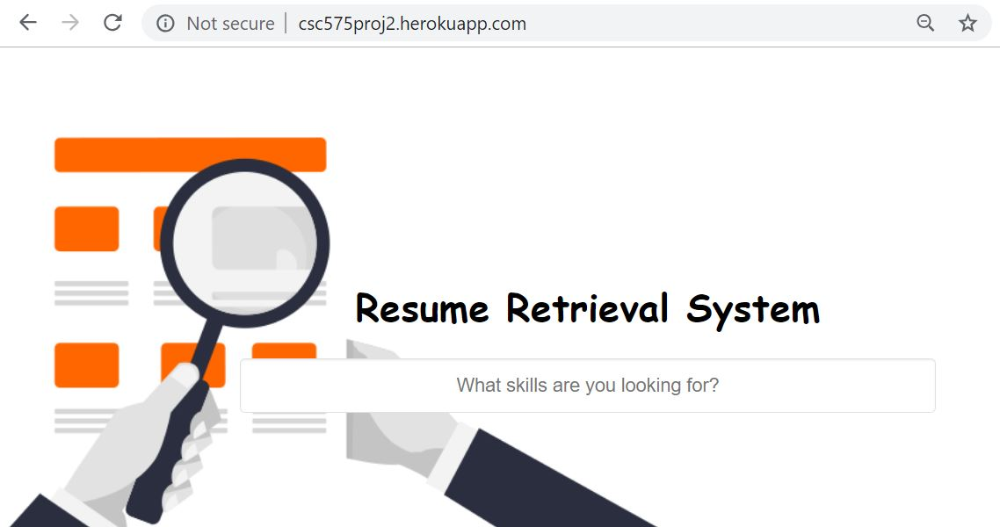
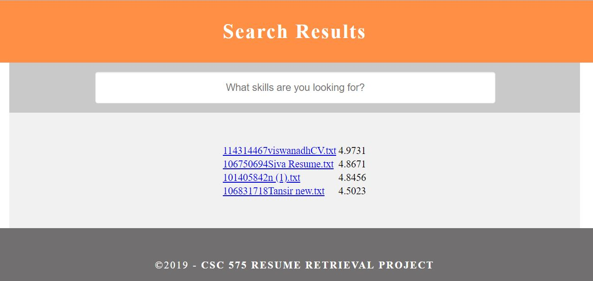
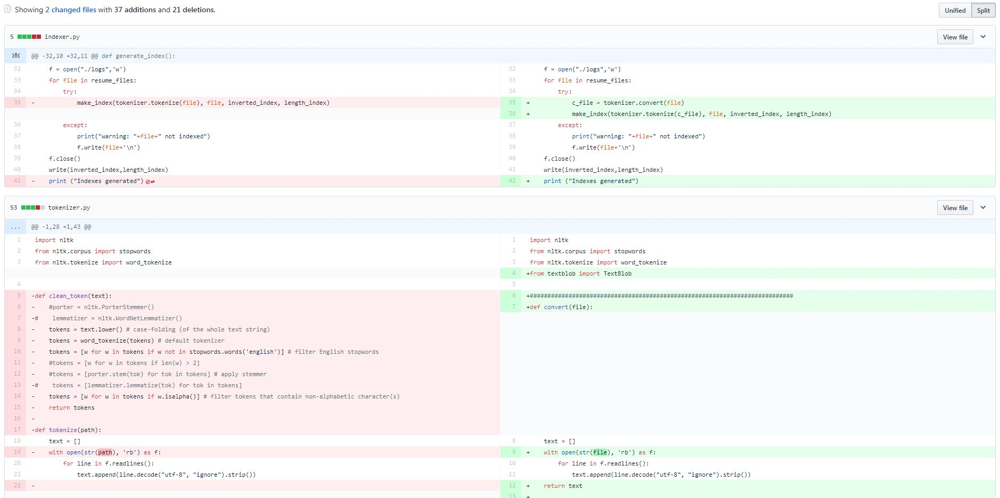
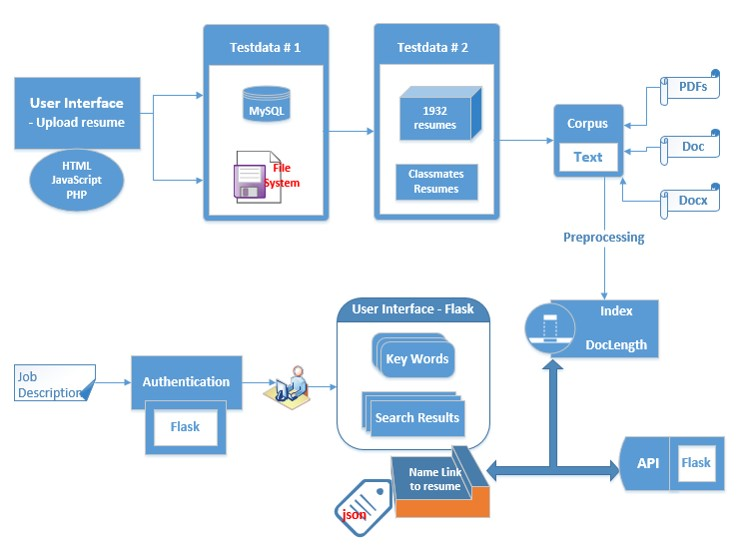
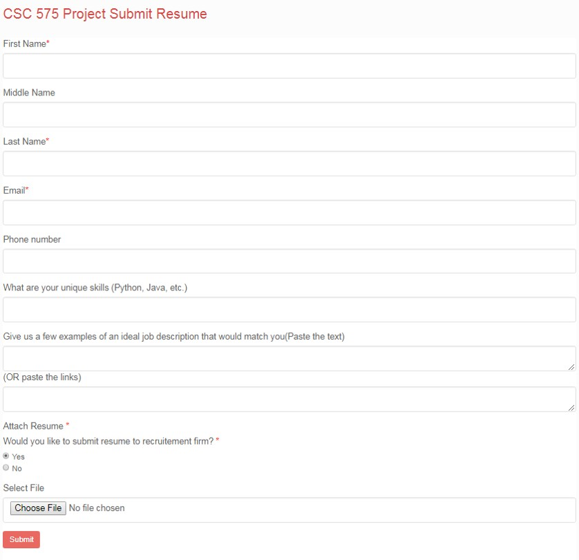

## Resume Retrieval and Ranking Applicaton on Colud Platform

The motivation was to apply text search to resumes on a live cloud platform in order to determine a candidate according to certain job qualifications. I'm using Heroku as the cloud platform and Flask as a Python Web Application Framework. Feel free to visit the link here:
<a href='https://resume-retrieval.herokuapp.com'>**Live Application**</a>
Note that our dataset has mostly resumes of electrical engineers. Example keywords would be <a href='https://resume-retrieval.herokuapp.com/?q=electrical+engineering'>electrical engineering</a>, <a href='https://resume-retrieval.herokuapp.com/?q=assemble+programming'>assembly programming</a>

The project is done between a group of three students at DePaul. We have very clear roles as follows:
* Folk (myself) - Application architecture and deployment on various platforms.
* Ivy - Literature analysis and review. Automated testing and evaluation.
* Ray - Data modelling and retrieval algorithms

I also would like to mention that working as a team, in terms of collaborating on programming, was not easy. We shared codes using github in order to migrate the changes to the web application without crashing the system.

## Design

While there is an overwhelming number of modules, we wanted to have a very lean architecture. The figure below shows a big picture of these modules which allow us to not loose our track. The upper region of the flow is offline development and the bottom region is regarding the cloud.

### Survey (Dataset #1)
Starting from the top left, the first module is the survey for our classmates as well as graduate students in the Data Science and Predictive Analytics program. The goal here is to get a set of resumes and job description that would be an ideal match according to their dream jobs. I coded this page using HTML, Javascript and PHP. The interface is responsive for using Bootstrap Responsive Design. The other metadata was stored in MySQL database. The files are stored in a protected filesystem.

Feel free to submit your resume here:
<a href="http://resumesearcher.atwebpages.com/resumeform.php">http://resumesearcher.atwebpages.com/resumeform.php</a>

### Survey (Dataset #2)
We downloaded the resumes from a public site with around 2000 resumes in various formats of PDF, Microsoft DOC and DOCX. These files are converted into plain text files.

### Index creation using simple TD-IDF and document length
The methodology is available here: https://nlp.stanford.edu/IR-book/html/htmledition/okapi-bm25-a-non-binary-model-1.html

## Cloud Application
* Flask Web Micro-Framework
* API / Backend
* API Endpoint / Frontend
* Document Download
* Heroku Platform
... to be continued ...

## Automated Testing
* Python Snippet to consume output from the API / scrape from frontend
* How to determine the ground truth

## Future Work
* Implementation with realtime data and authentication
* Implementation of relevance feedback to improve search experience by building this system under an Application Tracking System (ATS)
* Trying different models
* Matching open positions for a single candidate

Stay tuned for this sections of the methodology