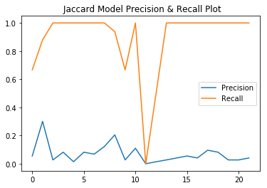
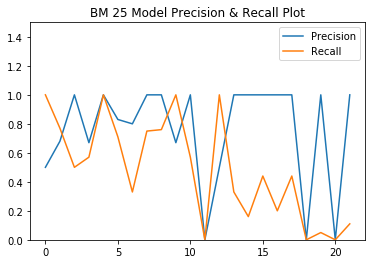

## Resume Retrieval and Ranking Application on Cloud Platform

<!--p>

</p-->

<iframe width="100%" height="600" src="https://resume-retrieval.herokuapp.com/" frameborder="0" gesture="media" allow="encrypted-media" allowfullscreen=""></iframe>

Artificial intelligence and automation in the hiring industry have been around for a while, and machine-learning aided resume filtering and job matching have matured over the recent years. Leading-edge machine learning tools in HR have set the trends for 2019 and the upcoming years, such as blind resume screening, in which hiring-relevant information has been preserved while information prone to gender and ethnicity - like bias is hidden. 

The Resume Retrieval System our group built not only hones the features required most currently for an HR tool, but more importantly, with layers of data protection, it addresses the General Data Protection Regulation. Our top motive was to build a retrieval tool for our peers in Data Science and Computer Science to optimize their resumes based on the retrieval results and enhance their job search experience. 

The idea on the technical end was to apply text search to resumes on a live cloud platform in order to determine a candidate according to certain job qualifications. I'm using Heroku as the cloud platform and Flask as a Python Web Application Framework. Feel free to visit the link here:
<a href='https://resume-retrieval.herokuapp.com'>**Live Application**</a>
Note that our dataset has mostly resumes of electrical engineers that are publicly availble from an online source. Example keywords would be <a href='https://resume-retrieval.herokuapp.com/?q=electrical+engineering'>electrical engineering</a>, <a href='https://resume-retrieval.herokuapp.com/?q=assemble+programming'>assembly programming</a>

### The Team
The project is done between a group of three students at DePaul. We have very clear roles as follows:
* Folk (myself) - Application architecture and deployment on various platforms.
* <a href="https://www.linkedin.com/in/ivyli678/">Ivy</a> - Literature analysis and review. Automated testing and evaluation.
* <a href="https://www.linkedin.com/in/ray-hu/">Ray</a> - Data modelling and retrieval algorithms

I think I had a great team and a memorable experience working with Ivy and Ray. Part of the challenge to this project is not only the development of a live server-side web application but also collaborating our work over cycles of deployment to the web server. A considerable portion of work was done in defining the right framework and protocol for incremental development on the same platforms. I think choosing the right tools helped us out to organize everything and consolidate the changes and contribution that each member had made. Thus, I would like to accentuate that collaboration was a valuable item I learned from this project and I would like to say thank you for to Professor <a href="https://www.cdm.depaul.edu/about/pages/people/facultyinfo.aspx?fid=776">Tomuro</a> giving us the opportunity to develop this skill and create a project that is practical in real world application.

### Collaboration
Github was used, in addition to Git, for collaborating between the team members who are responsible for different modules such as the search algorithms, the user interface and the web application in order to track and review the changes before it will be branched into the main code repository. This avoids the changes, such as renaming the function that was previously assigned to the frontend, that might crash the whole web application.

## Design

While there is an overwhelming number of modules, we wanted to have a very lean architecture. The figure below shows a big picture of these modules which allow us to not loose our track. The upper region of the flow is offline development and the bottom region is regarding the cloud.

### Survey (Dataset #1)
Starting from the top left, the first module is the survey for our classmates as well as graduate students in the Data Science and Predictive Analytics program. The goal here is to get a set of resumes and job description that would be an ideal match according to their dream jobs. I coded this page using HTML, Javascript and PHP. The interface is responsive for using Bootstrap Responsive Design. The other metadata was stored in MySQL database. The files are stored in a protected filesystem.

Feel free to submit your resume here:
<a href="http://resumesearcher.atwebpages.com/resumeform.php">http://resumesearcher.atwebpages.com/resumeform.php</a>

### Survey (Dataset #2)
We downloaded the resumes from a public site with around 2000 resumes in various formats of PDF, Microsoft DOC and DOCX. These files are converted into plain text files.

### Index creation using simple TD-IDF and document length
A customized tokenize function and an index generator are two major components in the pre-processing section. First, the customized tokenize includes a POS tag phaser and a WordNetLemmatizer() lemmatizer. The keywords of resumes usually belong to 'noun' such as 'python, SQL, data, engineering' etc. However, in some use case such as 'electrical engineer', the 'adj' word electrical could be the keyword as well. Therefore, we first used the POS tag to extract the NOUN and ADJ to reduce the numbers of tokens and hence speed up the processing. Then, to get more readable outputs, we used lemmatization, instead of stemmer, to ensure the root word belongs to the dictionary. Along with the stop words and non-alpha tokens removed, we generate our final token list. Moreover, we could implement the tokenize function to process either short or long queries in followed sections. We used an index generator to get the required inverted index and length index for bm25. For retrieval purpose, we appended the document names instead of document IDs to both indexes so that we can get the resumes names after calling the searching function. In the future, to deal with a larger resume pool, we would take the single-pass in-memory indexing method into consideration.

### Retrieval Algorithm
In the current version of the system, the designed use case would be keyword search. Considering the system efficiency, we deployed the bm25 online and used Jaccard similarity for offline reference. Moreover, the longer query such as job description would take into consideration for the next iteration. Therefore, we applied the word2vector model and tested the cosine similarity offline as well.

Bm25 is an algorithm, which based on the probability retrieval model,  used to evaluate the correlation between search terms and documents. The description of the algorithm is available here: https://nlp.stanford.edu/IR-book/html/htmledition/okapi-bm25-a-non-binary-model-1.html

#### A rough comparison of two retrieval models

  
  

## Cloud Application Development
### Heroku
Heroku is a cloud platform as a service supporting several programming languages such as Java, Node.js, Scala, Python, etc. The app can be deployed using the Git version control system. There is no file management system that allows the files to be uploaded as if they were to be accessed through a FTP protocol. In this project, Gunicorn web server was used to serve Flask web framework which runs under Python.

The development started from the backend of the retrieval system. The initial goal was to get a list of relevant document with the scores in JSON format using the BM25 retrieval algorithm. To archive this, a search application programming interface (API) was developed under to test on a plain text interface. The Python program simply extracts the search terms using the HTTP GET method to fetch the parameter ‘q’ and assigns it to the function parameter of the BM25 class.

The way that the web application works is to initialize by creating the index file, invoked by calling the method generateIndex() from the indexer class. After so, an instance is kept in execution to serve the user’s HTTP requests. The search API is routed to the BM25 search function that looks into the index and retrieve the document names and the match scores in a JSON format of both tuples as an array. 

The interface is simply making a chained request to the search API but instead of returning the search results into plain JSON text format, the results is assigned as parameter into another function that parse this JSON data and renders it into a HTML template. Flask has a request library similar to the one in base Python.

The HTML template has anchors in Python syntax to parse the results from the API and loop through the array of tuples. In other words, the headers, footers and containers are static but the content for the search results are dynamic and are generated into a table HTML element. Refer to the search_results.html in the templates directory.

### Deployment
Unlike typical platforms that has a certain protocol which establish direct access to a file system, the deployment to a cloud platform is rather tedious. Heroku uses Git version control which would only make changes to the files that are changed in the same way that changes are merged in Github using a pull request. The open source tools from Git and Heroku helps to archive this on a command line interface (CLI).

Heroku CLI is created by the platform owner themself. Although the website has an interface for performing basic web application management such as shutting down for maintenance, resource usage and monitoring, it does not integrate the application development on the local system to the live application and escalate to a production level. This can only be done by associating the “changes” on local development to the live application. Heroku CLI does this by letting the user login, create or select application on the cloud (because there multiple applications under one user) and create a pull request using Git to download the files to the local system.

## Automated Testing
Automated testing was implemented for evaluating the retrieval results. The ground truth was built upon the acquisition of a set of qualifications / queries and by mannaly going through a random set of resumes to identify the relevant ones based on domain knowledge. Web scraping our own website was utilized to retrieve the search results. The precision and recall is based on the formula from text book that applies the intersection of both results to yield the retrieved relevant results. A comparison between the BM 25 model and Jaccard Model is also performed and error analysis is done for evaluation as well.  

#### Mean Average Precision
* BM25: 0.76
* Jaccard: 0.07

## Future Work
For future work, we can start by implementing different retrieval models to find the most suitable one, or even use a combination of multiple methods. We should also have our own file system where we store and accept users submitting quality domain specific resumes. We aim to develop this system for the real world and have hiring professionals test out and evaluate our system for relevance feedback. With the functionality to have users submit resumes, we should also implement a recommender system to generate job recommendations tailored to each candidate based on resume submitted. 

* Implementation with realtime data and authentication
* Implementation of relevance feedback to improve search experience by building this system under an Application Tracking System (ATS)
* Trying different models
* Matching open positions for a single candidate

