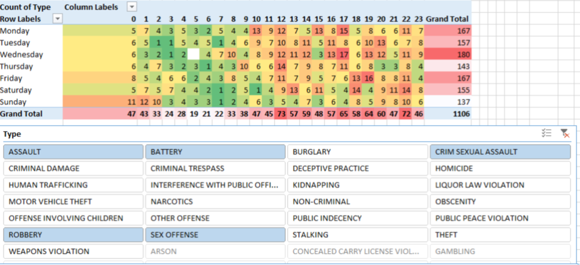
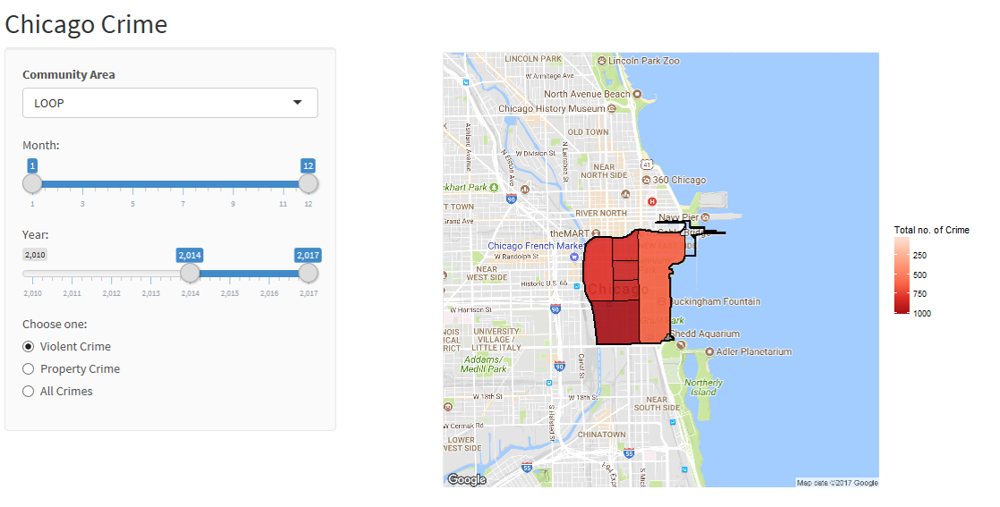

## Temporal Chicago Crime Interactive Map and Analysis under User-centric hierarchies (R and Shiny module)

This project is inspired by my personal experience when I was deciding on which Chicago neighborhood is ideal for renting an apartment. The things i consider are safety, distance to public transportation, distance to downtown and price.

Safety is the most important concern of all. It can be broken down into two aspects which are in regards to the apartment building and the route from the public transportation to the building. I looked at the no go zone map when I started researching for apartments in Chicago. Here is an example:

<p align="center">

</p>

This map, however, fails to account for explicitly showing the two safety aspects mentioned. The map includes all types of crime which are not relevant to user needs. Thus an interactive map that allows user to switch through crime types would better provide this information. Alternatively, several static maps of different crime types can also answer to these needs.

I contributed the this project in programming visualization in R and by driving team forward to meet deliverable requirements. After teaming with five people through the discussion forum, I’ve set up meetings and agendas and have taken minutes of meeting on three meetups. When it was close to project deliverable deadline, we did not have directions as our exploratory data analysis does not show any interesting patterns nor correlation on the our hypothesis questions which is crossing Chicago crime data with other data (eg. census data). I got inspired by making examples of heatmap with Excel using pivot tables, data slicers, and colored auto-formatting as shown below.
<p align="center">

</p>

The example above shows the occurance of violent crime based on time of the day and day of the week. It was a successful prototype that led to making user centric heirachies that are related to deciding which part of the community area is ideal.

Since it is hard to figure out what would be the user requirements, I made an interactive R program using Shiny module. It generates a HTML page that allow parameters to be adjusted.

<p align="center">
  
  
</p>

Sample Code:

``` R
ui <- fluidPage(theme = shinytheme("lumen"),
                titlePanel("Chicago Crime"),
                sidebarLayout(
                  sidebarPanel(
                    
                    # Select type of trend to plot
                    selectInput(inputId = "input_community_area", label = strong("Community Area"),
                                choices = unique(community_area_centroid$community_area),
                                selected = "LOOP"),
                    
                    sliderInput("month", "Month:",
                                min = 1, max = 12,
                                value = c(1,12)),

                    sliderInput("year", "Year:",
                                min = 2010, max = 2017,
                                value = c(2017,2017)),
                    radioButtons("ctype", "Choose one:",
                                 choiceNames = list(
                                   "Violent Crime",
                                   "Property Crime",
                                   "All Crimes"
                                 ),
                                 choiceValues = list(
                                   "violent", "property", "all"
                                 ))
                  ),
                  
                  # Output: Description, lineplot, and reference
                  mainPanel(
                    plotOutput(outputId = "chicagoCrimeMap", height = "500px")#,
                    #  textOutput(outputId = "desc"),
                    #  tags$a(href = "https://www.google.com/finance/domestic_trends", "Source: Google Domestic Trends", target = "_blank")
                  )
                )
)

# Define server function
server <- function(input, output) {
  
  output$chicagoCrimeMap <- renderPlot({
    
    # SUBSET DATA
    crimedata <- crimecsv %>%
      filter(
        month >= as.numeric(input$month[1]) & month <=as.numeric(input$month[2]) &
          year >= as.numeric(input$year[1]) & year <=as.numeric(input$year[2])
      )
    if(input$ctype=='violent') {
      crimedata <- filter(crimedata, Primary.Type=='HOMICIDE'|Primary.Type=='CRIMINAL SEXUAL ASSAULT'|Primary.Type=='ROBBERY'|Primary.Type=='ASSAULT'|Primary.Type=='BATTERY')
    } else if(input$ctype=='property') {
      crimedata <- filter(crimedata, Primary.Type=='BURGLARY'|Primary.Type=='LARCENY'|Primary.Type=='MOTOR VEHICLE THEFT'|Primary.Type=='ARSON')
    }
    
    # GET MAP from GOOGLE
    community_area_coord <- 
      community_area_centroid[community_area_centroid$community_area==input$input_community_area,]
    mapImage <- get_map(location = c(lon = community_area_coord$lon, lat = community_area_coord$lat), zoom=13)
    
    # DRAW COMMUNITY AREA BORDER
    area_border <- area
    area_border <- subset(area_border, community==input$input_community_area)
    
    # GET SHAPE WITHIN COMM AREA
    area2.sub <- raster::intersect(area_border,area2.sub)
    area2_sub_fortify <- fortify(area2.sub, region = "beat_num")
    
    # AGG CRIME DATA
    coords <- crimedata[c("Longitude","Latitude")]
    coords <- na.omit(coords)
    sp <- SpatialPoints(coords)
    shape_over <- over(sp,area2.sub)
    by_beat_num <- shape_over %>%
      group_by(beat_num) %>%
      summarize(total=n())
    
    by_beat_num <- by_beat_num[!is.na(by_beat_num$beat_num),]
    colnames(by_beat_num) <- c("id","total")
    by_beat_num$id <- as.character(by_beat_num$id)
    
    # JOIN WITH MAP
    total_map <- left_join(area2_sub_fortify,by_beat_num)

    ggmap(mapImage) +
      geom_polygon(data = total_map, aes(x=long, y=lat, group=group, fill=total), 
                   color="black",size=0.5,alpha=0.9) +
      # scale_fill_gradient(low='white', high='red') +
      scale_fill_distiller(type="seq", trans="reverse", palette = "Reds") +
      geom_polygon(data = area_border, aes(x=long, y=lat, group=group, fill=total), 
                   color = "black", fill=NA, size=1) +
      labs(fill='Total no. of Crime')  +
      theme(axis.line=element_blank(),axis.text.x=element_blank(),
            axis.text.y=element_blank(),axis.ticks=element_blank(),
            axis.title.x=element_blank(),
            axis.title.y=element_blank())
  })
  
}
```
